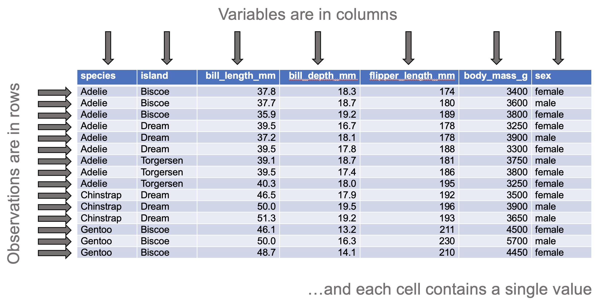
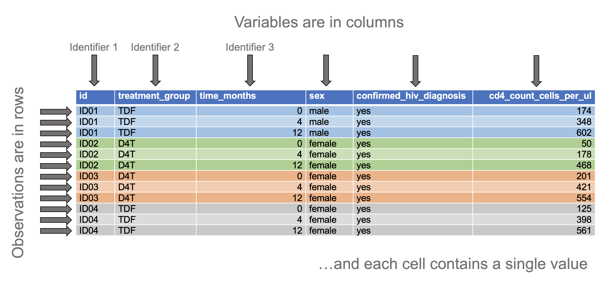

```{r setup, include = FALSE}
library(flexdashboard)
library(shiny)
library(dplyr)
library(tidyr)
library(readxl)
library(readr)
#library(lme4)
library(skimr)
#library(car)
#library(gmodels)
library(janitor)

# skimr variables
my_skim <- skim_with(base = sfl(Missing = n_missing,
                                Complete = n_complete),
                     numeric = sfl(mean = NULL, sd = NULL,
                                   p0 = NULL, p25 = NULL, p50 = NULL, 
                                   p75 = NULL, p100 = NULL, hist = NULL,
                                   Mean = ~ mean(., na.rm = TRUE),
                                   SD = ~ sd(., na.rm = TRUE),
                                   Min = ~ min(., na.rm = TRUE),
                                   Q1 = ~ quantile(., probs = 0.25, na.rm = TRUE),
                                   Median = ~ quantile(., probs = 0.5, na.rm = TRUE),
                                   Q3 = ~ quantile(., probs = 0.75, na.rm = TRUE),
                                   Max = ~max(., na.rm = TRUE)),
                     factor = sfl(ordered = NULL,
                                  top_counts = NULL,
                                  `Top 3 levels` = ~ top_counts(., 
                                                                max_char = 15,
                                                                max_levels = 3)))
```

```{r eval = FALSE}
# Packages
library(stringr)
library(palmerpenguins)

# Datasets
## Long format
### Iris
iris %>% 
    write_csv(file = 'data/iris_original.csv')

iris %>% 
    group_by(Species) %>% 
    slice_head(n = 5) %>% 
    ungroup() %>% 
    select(Species, everything()) %>% 
    write_csv(file = 'data/iris_reduced.csv')

### Penguins
penguins %>% 
    write_csv(file = 'data/penguins_orginal.csv')

penguins %>% 
    filter(complete.cases(.)) %>% 
    group_by(species, island) %>% 
    slice_head(n = 3) %>% 
    ungroup() %>% 
    select(-year) %>% 
    select(species, everything()) %>% 
    write_csv(file = 'data/penguins_sample.csv')
```

Welcome {data-nav='Welcome'}
===================================== 

<!--- <a href='https://www.wits.ac.za' target='_blank'>

</a> --->

**Welcome**  

The app provides basic statistical tests (e.g., t-test, ANOVA, correlation, linear regression)

To plot your data, please use the companion app, [`plotr`](https://kamermanpr.shinyapps.io/painblogr-plotr/){ target='_blank' }

**Steps to analysing your data**  

- Go to the _"Upload data"_ page, upload your data and choose the variables according to whether they are numeric values or categorical values

- Once the data have been uploaded and variables selected, choose the type of analysis you want from the drop-down menu labelled _“Analysis”_.

- Select the variables to analyse (summary information, basic plots, and the results of the statistical test will be auto-generated).

**Data format**  

Only comma-separated values (CSV) and MS Excel (XLSX and XLS) files can be uploaded. The first row of the file must be column headings, and for repeated measure study designs, at least one of the columns must provide observation IDs (e.g., unique participant/patient numbers). Lastly, the data must be "tidy". 

By "tidy", we mean that the data must be arranged in "long" format such that:

- Each row contains data from an observation. Where data are collected from the same individuals on multiple occasions, each observation of an individual must be placed in a separate row (see the "Tidy data with repeated measures" example below).  

- Each column contains only one variable.

- Each value must have its own cell

<div>
<p>
<strong>Tidy data</strong>
</p>

</div>

<div>
<p>
<strong>Tidy data with repeated measures</strong>
</p>

</div>

For a full description of tidy data, please use the following [link](https://www.jstatsoft.org/article/view/v059i10){ target='_blank' }.

To download a dataset to play around with on the app, we recommend [Allison Horst's](https://allisonhorst.github.io/palmerpenguins/index.html){ target='_blank' } "Palmer Penguins" dataset ([link to data](https://drive.google.com/open?id=1-8H1Mz2_oEMu3zlVsatraFruJQlCFqZ9&authuser=peter.kamerman%40gmail.com&usp=drive_fs){ target='_blank' })

**Developers**  

The app was developed by Peter Kamerman (WWW: [painblogr.org](https://www.painblogr.org){ target='_blank'}, GitHub: [kamermanpr](https://github.com/kamermanpr){ target='_blank' }).

Please cite this app as: Kamerman PR (2021). statr: online statistical tests. Version: v0.1.3. DOI: [10.5281/zenodo.5977332](https://doi.org/10.5281/zenodo.5977332).

**License**  

The software is released under an [MIT license](https://github.com/kamermanpr/painblogr-statr/blob/main/LICENSE){ target='_blank' }.

**Issues**

To report any issues you have with the app, please use the following [link](https://github.com/kamermanpr/painblogr-statr/issues){ target='_blank' }.

**Software citations**

- R Core Team (2021). R: A language and environment for statistical computing. R Foundation for Statistical Computing, Vienna, Austria. URL: [https://www.R-project.org/](https://www.R-project.org/){ target='_blank' }.

- Jeffrey B. Arnold (2021). ggthemes: Extra Themes, Scales and Geoms for 'ggplot2'. R package version 4.2.4. URL: [https://CRAN.R-project.org/package=ggthemes](https://CRAN.R-project.org/package=ggthemes){ target='_blank' }.
  
- Winston Chang, Joe Cheng, JJ Allaire, Carson Sievert, Barret Schloerke, Yihui Xie, Jeff Allen, Jonathan McPherson, Alan Dipert and Barbara Borges (2021). shiny: Web Application Framework for R. R package version 1.7.1. URL: [https://CRAN.R-project.org/package=shiny](https://CRAN.R-project.org/package=shiny){ target='_blank' }.
  
- Lionel Henry and Hadley Wickham (2021). rlang: Functions for Base Types and Core R and 'Tidyverse' Features. R package version 0.4.12. URL: [https://CRAN.R-project.org/package=rlang](https://CRAN.R-project.org/package=rlang){ target='_blank' }.

- Richard Iannone, JJ Allaire and Barbara Borges (2020). flexdashboard: R Markdown Format for Flexible Dashboards. R package version 0.5.2. URL: [https://CRAN.R-project.org/package=flexdashboard](https://CRAN.R-project.org/package=flexdashboard){ target='_blank' }.

- Elin Waring, Michael Quinn, Amelia McNamara, Eduardo Arino de la Rubia, Hao Zhu and Shannon Ellis (2021). skimr: Compact and Flexible Summaries of Data. R package version 2.1.3. URL: [https://CRAN.R-project.org/package=skimr](https://CRAN.R-project.org/package=skimr){ target='_blank' }.

- Hadley Wickham, Romain François, Lionel Henry and Kirill Müller (2021). dplyr: A Grammar of Data Manipulation. R package version 1.0.7. URL: [https://CRAN.R-project.org/package=dplyr](https://CRAN.R-project.org/package=dplyr){ target='_blank' }.

- Hadley Wickham, Jim Hester and Jennifer Bryan (2021). readr: Read Rectangular Text Data. R package version 2.1.1. URL: [https://CRAN.R-project.org/package=readr](https://CRAN.R-project.org/package=readr){ target='_blank' }.

- Hadley Wickham (2021). tidyr: Tidy Messy Data. R package version 1.1.4. URL: [https://CRAN.R-project.org/package=tidyr](https://CRAN.R-project.org/package=tidyr){ target='_blank' }.

- Hadley Wickham and Jennifer Bryan (2019). readxl: Read Excel Files. R package version 1.3.1. URL: [https://CRAN.R-project.org/package=readxl](https://CRAN.R-project.org/package=readxl){ target='_blank' }.

- Hadley Wickham (2016). ggplot2: Elegant Graphics for Data Analysis. Springer-Verlag, New York.

Upload data {data-nav='Upload data'}
=====================================

Column {.sidebar data-width=350}
-------------------------------------

```{r upload_1}
h1('Upload data')

p('Once the data have been uploaded, choose all variables that should be treated as numeric variables, and all variables that should be treated as categorical variables.')

hr()

# File format
radioButtons(inputId = 'type0', 
             label = 'File type', 
             choices = c('CSV (default)' = 'csv',
                         'XLSX or XLS' = 'excel'),
             selected = 'csv')

# Upload file
fileInput(inputId = 'file0', 
          label = 'Import data',
          multiple = FALSE,
          accept = c('.csv', '.xlsx', '.xls'))

# Make reactive data
df <- reactive({
    req(input$file0)
    
    if(input$type0 == 'csv'){
        
        read_csv(input$file0$datapath) %>% 
            clean_names()
        
    } else if(input$type0 != 'csv'){
        
        read_excel(input$file0$datapath) %>% 
            clean_names()
        
    }
})

# Choose numeric columns
output$data_numeric <- renderUI({
    varSelectizeInput(inputId = 'numeric',
                      label = 'Select numeric variables',
                      multiple = TRUE,
                      data = df())
})

uiOutput('data_numeric')

# Choose categorical columns
output$data_categorical <- renderUI({
    varSelectizeInput(inputId = 'categorical',
                      label = 'Select categorical variables',
                      multiple = TRUE,
                      data = df())
})

uiOutput('data_categorical')

```

Row 
-------------------------------------

### Table 1: Summary of numeric variables

```{r upload_2}
df_numeric <- reactive({
    req(df())
    df() %>% 
        select(!!!input$numeric) %>% 
        mutate(across(.cols = everything(), ~ as.numeric(.x)))
})

output$tbl_numeric <- renderTable(
    if(ncol(df_numeric()) != 0){
        df_numeric() %>% 
            my_skim() %>% 
            yank('numeric') %>% 
            rename(Variable = skim_variable)
    }
)

tableOutput('tbl_numeric')
```

### Table 2: Summary of categorical variables

```{r upload_3}
df_categorical <- reactive({
    req(df())
    df() %>% 
        select(!!!input$categorical) %>% 
        mutate(across(.cols = everything(), ~ as.factor(.x)))
})

output$tbl_categorical <- renderTable(
    if(ncol(df_categorical()) != 0){
        df_categorical() %>% 
            my_skim() %>% 
            yank('factor') %>% 
            rename(Variable = skim_variable,
                   `Unique levels` = n_unique)
    }
)

tableOutput('tbl_categorical')
```

```{r upload_4}
# Generate combined data file
df_combined <- reactive({
    bind_cols(df_numeric(), df_categorical())
    })
```

Continuous y ~ Categorical x {data-navmenu='Analysis'}
=====================================  

Inputs {.sidebar data-width=350}
-------------------------------------

```{r}
h1('Continuous y ~ Categorical x')

p(strong('Remember to upload your data first.'))

hr()

# Select variables
## Response variable
output$yvar <- renderUI({
    req(df_numeric())
    varSelectInput(inputId = 'y_var',
                   label = 'Choose response (y) variable',
                   selected = NULL,
                   data = df_numeric())
    })

uiOutput('yvar')

## Grouping variable
output$groupvar <- renderUI({
    req(df_categorical())
    varSelectInput(inputId = 'group_var',
                   label = 'Choose grouping (x) variable',
                   selected = NULL,
                   data = df_categorical())
    })

uiOutput('groupvar')

hr()

p(strong('Independent measures design'))


hr()

p(strong('Repeated measures design'))

# Select unique identifier variable
output$idvar <- renderUI({
    req(df_numeric())
    varSelectInput(inputId = 'id_var',
                   label = 'Choose identifier variable',
                   selected = NULL,
                   data = df_combined())
    })

uiOutput('idvar')
```
